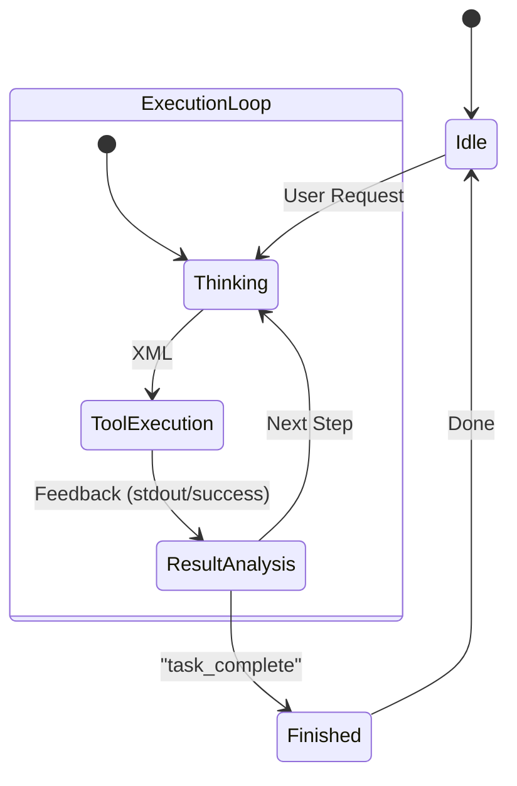
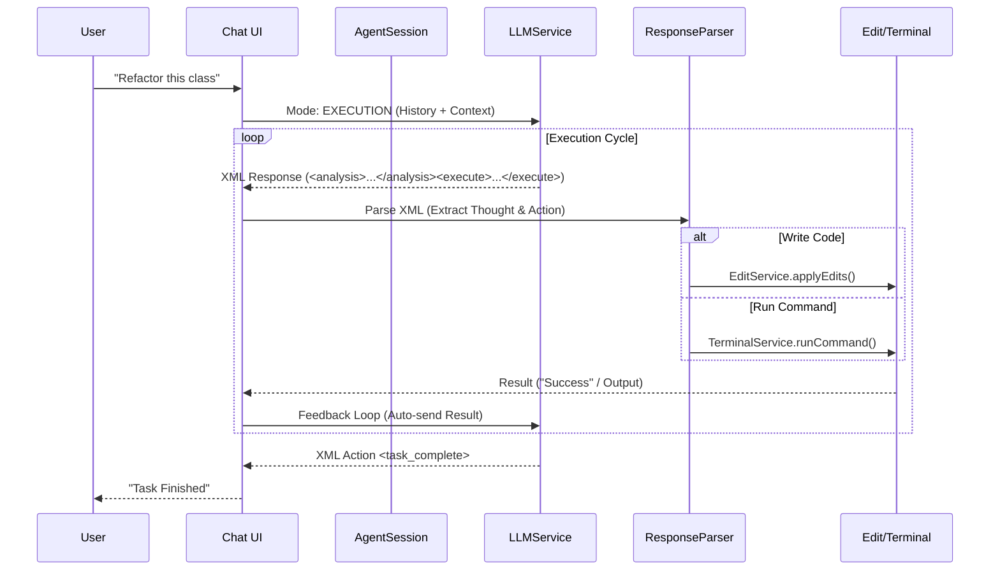

# ⚔️ Ronin

> **"The masterless coding agent. Serving only your code."**

<!-- Plugin description -->
**Ronin** is the masterless coding agent, serving only your code. 

## ⚡ The Philosophy: Stability in a Volatile World

**Ronin** was born from a simple observation: **proprietary tools are volatile.** We've all seen the cycle: excellent tools attract early adopters with "unlimited" promises, only to alter the deal, cap productivity, or change Terms of Service overnight when the economics shift.

We believe a developer's environment should be **deterministic infrastructure**, not a shifting service. You shouldn't be penalized for being "too productive" — and your workflow shouldn't break because a company decides to pivot.

**Ronin is different.** We are removing the rent-seeking layer entirely. This is about trust, sovereignty, and code.
<!-- Plugin description end -->

## 🛡️ The Ronin Covenant

Unlike services that operate as "black boxes," Ronin operates on three non-negotiable rules designed to future-proof your workflow:

### 1. Sovereignty (Bring Your Own Key)
**You provide the brains; Ronin provides the body.** Connect directly to OpenAI, Anthropic, or DeepSeek using your own keys. 
* **No middleman markup.**
* **No "pooled capacity" limits.**
* **No opaque tiers.** As long as you have a key, Ronin works.

### 2. Privacy & Independence (Local-First)
A companion that relies 100% on the cloud isn't a tool; it's a dependency.
Ronin treats `localhost` as a first-class citizen. With native support for **Ollama** and local LLMs, you can build entirely offline. Your code never leaves your machine unless *you* decide to send it.

### 3. Radical Transparency (No Rug-Pulls)
Ronin is client-side software. We cannot downgrade your tier because **there is no tier**. We cannot revoke your access because the code lives on your machine.

> **"Reliability is not an optional feature. It is the baseline."**

## 🚀 Why This Matters

As engineers, we need tools that respect our expertise:

1.  **Deterministic:** Terms of Service shouldn't change based on a company's burn rate.
2.  **Transparent:** Limits should be explicit (defined by your API provider), not hidden behind vague definitions of "abuse."
3.  **Accessible:** By providing full access to the source code, we ensure this tool belongs to the community, forever.

Ronin doesn't have a hidden agenda or a "fair usage policy" designed to slow you down. **Ronin just wants to help you ship code.**

## 🏗️ Project Structure

The codebase is organized into clear functional components:
> *Implemented based on [Discussion #1](https://github.com/xangcastle/ronin/discussions/1)*

*   **`src/main/kotlin/com/ronin/actions`**: Entry points for user interactions (e.g., `ExplainCodeAction`, `FixCodeAction`).
*   **`src/main/kotlin/com/ronin/ui`**: Manages the Tool Window, Chat UI, and message history.
*   **`src/main/kotlin/com/ronin/service`**: The agent's core logic:
    *   **`LLMService`**: Communicates with AI providers (OpenAI, etc.).
    *   **`RoninConfigService`**: Manages project context, rules, and structure.
    *   **`EditService`**: Safely modifies files in the editor using the IntelliJ SDK.

## 🧠 Agentic Architecture: The Thought-Action Protocol

Ronin operates as a continuous **Agentic Loop** that thinks before it acts. It eliminates the friction of manual approval steps, prioritizing speed and autonomy ("Vibe Coding").

### The Loop
Every time you send a request, Ronin enters a strict **Thought-Action Cycle**:

1.  **Thinking (`<analysis>`)**: The agent reflects on the task, analyzes the file, and plans specific edits.
2.  **Action (`<execute>`)**: The agent performs a single, atomic action (e.g., `write_code`, `run_command`).
3.  **Observation**: The tool output (e.g., compiler error, specific file content) is fed back into the context.
4.  **Loop**: `Analyze` -> `Execute` -> `Verify` -> `Next`.

### The Execution Flow

## ⚙️ System Components

### Services (`src/main/kotlin/com/ronin/service`)
The nervous system of the agent.

| Service | Responsibility |
| :--- | :--- |
| **`AgentSessionService`** | **State Manager**. Tracks the active session and history. Delegates persistence to `ChatStorageService`. |
| **`LLMService`** | **The Brain**. Manages API connections. Enforces **Protocol v3 (XML/CoT)** for robust "System 2" thinking. |
| **`ResponseParser`** | **The Ear**. Parses XML Protocol. Separates `<analysis>` (Thinking, visible in UI as thoughts) from `<execute>` (Actions). |
| **`RoninSettingsState`** | **The Identity**. Manages **The Stances** (Personas, Credentials, Models). |
| **`RoninConfigService`** | **The Environment**. Reads `.roninrules`, `ronin.yaml`, and project structure to ground the agent in reality. |
| **`EditService`** | **The Hands**. Safely modifies files using `WriteCommandAction`. Supports fuzzy matching and atomic undo. |
| **`TerminalService`** | **The Legs**. Executes shell commands, capturing stdout/stderr to feed back into the reasoning loop. |

### Actions (`src/main/kotlin/com/ronin/actions`)
Context-menu triggers that bootstrap the agent with specific intents.

*   **`ExplainCodeAction`**: Sends selected code with "Explain this..." prompt.
*   **`FixCodeAction`**: Sends selected code with "Fix bugs..." prompt.
*   **`ImproveCodeAction`**: Asks for refactoring ideas.
*   **`GenerateUnitTestsAction`**: Asks for test coverage.
*   **`BaseRoninAction`**: Abstract base that handles the pipeline: `Open Window -> Gather Context -> Send -> Apply`.

## 🤺 The Stances (Samurai & Sovereignty)

> *Implemented based on [Discussion #2](https://github.com/xangcastle/ronin/discussions/5)*

We realized that "selecting a model" is outdated. Engineers wear different hats: mostly editing, sometimes architecting, rarely debugging. A generic "Chat with AI" window doesn't capture this nuance.

Ronin replaces plain model selection with **Stances**—expert personas that bind a **System Prompt**, **Model**, **Scope**, and **Credential** into a single, switchable unit.

### 1. Infinite Flexibility (Create Your Own)
You are not limited to the defaults. The **Stance Editor** (located in `Settings > Tools > Ronin`) allows you to craft unlimited personas tailored to your specific workflow:
*   Create **"The Auditor"**: A stance that only sees `security/` folders and uses a specialized security prompt.
*   Create **"The Refactorer"**: A stance using `o1-preview` with a prompt strictly forbidding any functional changes.
*   Create **"The Jester"**: A stance that writes comments in haiku.

### 2. The Samurai Personas (Starter Pack)
Out of the box, we provide three disciplined defaults:
*   **The Daimyo (Architect)**: `gpt-4o`. Sees everything. Slow, deliberate, focuses on patterns.
*   **The Shinobi (Editor)**: `gpt-4o-mini`. Sees only current file. Fast, surgical, no "yapping".
*   **The Ronin (Frontend)**: `gpt-4o`. Specialized in UI/CSS reliability.

### 3. Enterprise Sovereignty (The "Day 1" Advantage)
This is where Ronin changes the game for teams. Organizations can **inject their own Stances at compile time**.

`./gradlew buildPlugin -Pstances=/path/to/corp_stances.json`

This means you can distribute a **Custom Corporate Build** of Ronin. When a new hire installs it:
1.  **Zero Config**: They instantly have your team's "Senior Architect" persona, your "Legacy Code" expert, and your "Unit Test Writer" pre-loaded.
2.  **Shared Cognition**: Everyone uses the same system prompts and scopes, ensuring consistent code style and behavior across the team.
3.  **Secure**: Keys are referenced by ID (`credentialId`), not hardcoded, so the config is safe to share.

### 4. Strict Mode
To ensure absolute determinism, Ronin removes all "magic fallbacks". A Stance must have a valid `credentialId` in your PasswordSafe.

### 5. Granular Telemetry (Persona-Based Metrics)
Because every Stance has a unique `credentialId`, organizations can issue distinct API keys for distinct personas. This unlocks powerful insights in your LLM provider's dashboard:
*   **Cost Attribution**: Know exactly how much "The Architect" costs vs "The Editor".
*   **Usage Patterns**: Discover if your team is spending more time planning (Daimyo) or fixing (Ronin).
*   **Rate Limiting**: Apply stricter limits to expensive "Reasoning Models" (o1) while keeping "Editor Models" (gpt-4o-mini) uncapped.

> **Note:** This data lives in **your** dashboard (e.g., OpenAI platform), not ours. Ronin remains a silent conduit; we see nothing. You own the keys, you own the metrics.

## 🗺️ Roadmap

### ✅ Architecture & Core
- [x] **Protocol v3**: Thought-Action architecture (XML/CoT) for "System 2" reasoning.
- [x] **Agentic Loop**: Autonomous `Command -> Execute -> Analyze` cycle.
- [x] **Context Awareness**: `RoninConfigService` for rule-based (`.roninrules`) and structural context.
- [x] **Persistence**: `ChatStorageService` saves history across IDE restarts (JSON-based).
- [x] **Robust File Ops**: "Safe Overwrite" checks and Fuzzy Search/Replace.

### ✅ LLM Capabilities
- [x] **OpenAI Integration**: Full support for `gpt-4o`, `gpt-4-turbo`.
- [x] **Advanced Reasoning**: Optimized support for `o1-preview` (Protocol v3 handles the thinking loop).
- [x] **Reliability**: Switch from JSON Schema (fragile) to XML Protocol (robust) to avoid strict-mode failures.
- [ ] **Anthropic**: Claude (Opus/Sonnet) Integration.
- [ ] **Google**: Gemini models integration.
- [ ] **DeepSeek**: DeepSeek models integration.
- [ ] **Kimi**: Support Kimi K2.
- [ ] **Minimax**: Support for Minimax M2.
- [ ] **Localhost**: Ollama (Llama 3, Mistral) support for offline privacy.

### ✅ Developer Experience (DX)
- [x] **Integrated Terminal**: Execute shell commands directly from chat options.
- [x] **Responsive UI**: Fluid message bubbles (`GridBagLayout`) that respect window size.
- [x] **Smart Logs**: Command outputs are summarized in UI to prevent clutter, but sent fully to LLM.
- [x] **Slash Commands**: Use `/init` to boostrap `ronin.yaml` or custom commands from `ronin/commands/*.md`.
- [ ] **UI/UX Polish (Ronin 2.0)**:
    - [ ] **Visual Polish**: Full Markdown support, Syntax Highlighting, and cleaner typography.
    - [ ] **Identity Awareness**: Dynamic themes and **Stance Avatars** (Helmets/Masks) to reinforce persona.
    - [ ] **Agentic Timeline**: Replace logs with collapsible "Thought-Action" pipelines and progress bars.
    - [ ] **Interactive Diffs**: Message bubbles with inline diffs and "Accept/Reject" buttons.
    - [ ] **Input Experience**: Slash autocomplete and Context Pills.
- [ ] **Multimodal**: Drag-and-drop image support for visual debugging.

## ⚡ Slash Commands

Ronin supports commands to trigger specific workflows:

### Built-in
*   **`/init`**: Automatically scans your Bazel workspace using `bazel query` and generates the `ronin.yaml` registry file.

### Custom
You can define your own commands by creating Markdown files in `ronin/commands/`:
1.  Create `ronin/commands/refactor.md`.
2.  Write your prompt template in the file.
3.  Type `/refactor` in the chat.
4.  Ronin effectively "pastes" that file content as your prompt.

## 📜 The Story: Forged in Public
Ronin is not built in a vacuum. Every major architectural decision is debated and refined by the community. We don't just ship features; we solve fundamental problems together.

*   **[Discussion #1: The Brain Protocol](https://github.com/xangcastle/ronin/discussions/1)** → Resulted in the **XML Thought-Action Architecture**, moving away from fragile JSON schemas to a robust "System 2" reasoning loop.
*   **[Discussion #2: The Stances](https://github.com/xangcastle/ronin/discussions/5)** → Resulted in **Strict Mode & Enterprise Sovereignty**. We rejected "magic fallbacks" in favor of 100% deterministic, expert personas.

---
*Build freely.*