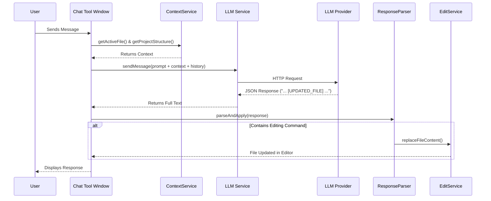

# ⚔️ Ronin

> **"The masterless coding agent. Serving only your code."**

<!-- Plugin description -->
**Ronin** is the masterless coding agent, serving only your code. 

## ⚡ The Philosophy: Stability in a Volatile World

**Ronin** was born from a simple observation: **proprietary tools are volatile.** We've all seen the cycle: excellent tools attract early adopters with "unlimited" promises, only to alter the deal, cap productivity, or change Terms of Service overnight when the economics shift.

We believe a developer's environment should be **deterministic infrastructure**, not a shifting service. You shouldn't be penalized for being "too productive" — and your workflow shouldn't break because a company decides to pivot.

**Ronin is different.** We are removing the rent-seeking layer entirely. This is about trust, sovereignty, and code.
<!-- Plugin description end -->

## 🛡️ The Ronin Covenant

Unlike services that operate as "black boxes," Ronin operates on three non-negotiable rules designed to future-proof your workflow:

### 1. Sovereignty (Bring Your Own Key)
**You provide the brains; Ronin provides the body.** Connect directly to OpenAI, Anthropic, or DeepSeek using your own keys. 
* **No middleman markup.**
* **No "pooled capacity" limits.**
* **No opaque tiers.** As long as you have a key, Ronin works.

### 2. Privacy & Independence (Local-First)
A companion that relies 100% on the cloud isn't a tool; it's a dependency.
Ronin treats `localhost` as a first-class citizen. With native support for **Ollama** and local LLMs, you can build entirely offline. Your code never leaves your machine unless *you* decide to send it.

### 3. Radical Transparency (No Rug-Pulls)
Ronin is client-side software. We cannot downgrade your tier because **there is no tier**. We cannot revoke your access because the code lives on your machine.

> **"Reliability is not an optional feature. It is the baseline."**

## 🚀 Why This Matters

As engineers, we need tools that respect our expertise:

1.  **Deterministic:** Terms of Service shouldn't change based on a company's burn rate.
2.  **Transparent:** Limits should be explicit (defined by your API provider), not hidden behind vague definitions of "abuse."
3.  **Accessible:** By providing full access to the source code, we ensure this tool belongs to the community, forever.

Ronin doesn't have a hidden agenda or a "fair usage policy" designed to slow you down. **Ronin just wants to help you ship code.**

---
*Build freely.*

## 🏗️ Project Structure

The codebase is organized into clear functional components:

*   **`src/main/kotlin/com/ronin/actions`**: Entry points for user interactions (e.g., `ExplainCodeAction`, `FixCodeAction`).
*   **`src/main/kotlin/com/ronin/ui`**: Manages the Tool Window, Chat UI, and message history.
*   **`src/main/kotlin/com/ronin/service`**: The agent's core logic:
    *   **`LLMService`**: Communicates with AI providers (OpenAI, etc.).
    *   **`ContextService`**: Reads the active file and project structure to give the agent context.
    *   **`EditService`**: Safely modifies files in the editor using the IntelliJ SDK.
    *   **`ResponseParser`**: Detects file update commands in the AI's response.
*   **`src/main/kotlin/com/ronin/settings`**: Manages user configuration (API keys, models).

## 🧠 Chat Architecture

How Ronin processes and acts on your requests:

## 🗺️ Roadmap

- [x] **Core Architecture**: Plugin skeleton and basic tool window.
- [x] **Chat Interface**: Functional chat UI with history.
- [x] **OpenAI Integration**: Live connection to OpenAI API.
- [x] **Context Awareness**: Agent "sees" your active file and folder structure.
- [x] **File Modification**: Agent can write code directly to your files.
- [ ] **Multi-Provider Support**: Full implementation for Anthropic, Gemini, Ollama (currently mocked).
- [ ] **Chat Persistence**: Save chat history across IDE restarts.
- [ ] **Multimodal Support**: Real image attachment processing.