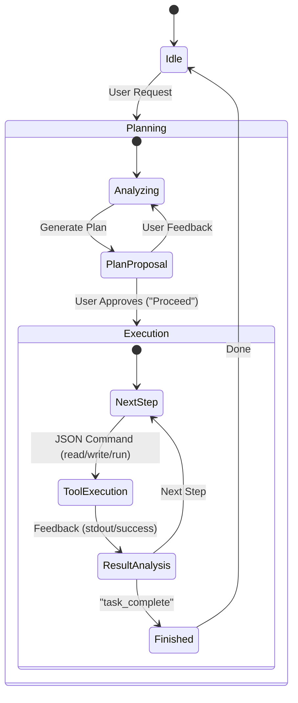

# ⚔️ Ronin

> **"The masterless coding agent. Serving only your code."**

<!-- Plugin description -->
**Ronin** is the masterless coding agent, serving only your code. 

## ⚡ The Philosophy: Stability in a Volatile World

**Ronin** was born from a simple observation: **proprietary tools are volatile.** We've all seen the cycle: excellent tools attract early adopters with "unlimited" promises, only to alter the deal, cap productivity, or change Terms of Service overnight when the economics shift.

We believe a developer's environment should be **deterministic infrastructure**, not a shifting service. You shouldn't be penalized for being "too productive" — and your workflow shouldn't break because a company decides to pivot.

**Ronin is different.** We are removing the rent-seeking layer entirely. This is about trust, sovereignty, and code.
<!-- Plugin description end -->

## 🛡️ The Ronin Covenant

Unlike services that operate as "black boxes," Ronin operates on three non-negotiable rules designed to future-proof your workflow:

### 1. Sovereignty (Bring Your Own Key)
**You provide the brains; Ronin provides the body.** Connect directly to OpenAI, Anthropic, or DeepSeek using your own keys. 
* **No middleman markup.**
* **No "pooled capacity" limits.**
* **No opaque tiers.** As long as you have a key, Ronin works.

### 2. Privacy & Independence (Local-First)
A companion that relies 100% on the cloud isn't a tool; it's a dependency.
Ronin treats `localhost` as a first-class citizen. With native support for **Ollama** and local LLMs, you can build entirely offline. Your code never leaves your machine unless *you* decide to send it.

### 3. Radical Transparency (No Rug-Pulls)
Ronin is client-side software. We cannot downgrade your tier because **there is no tier**. We cannot revoke your access because the code lives on your machine.

> **"Reliability is not an optional feature. It is the baseline."**

## 🚀 Why This Matters

As engineers, we need tools that respect our expertise:

1.  **Deterministic:** Terms of Service shouldn't change based on a company's burn rate.
2.  **Transparent:** Limits should be explicit (defined by your API provider), not hidden behind vague definitions of "abuse."
3.  **Accessible:** By providing full access to the source code, we ensure this tool belongs to the community, forever.

Ronin doesn't have a hidden agenda or a "fair usage policy" designed to slow you down. **Ronin just wants to help you ship code.**

---
*Build freely.*

## 🏗️ Project Structure

The codebase is organized into clear functional components:

*   **`src/main/kotlin/com/ronin/actions`**: Entry points for user interactions (e.g., `ExplainCodeAction`, `FixCodeAction`).
*   **`src/main/kotlin/com/ronin/ui`**: Manages the Tool Window, Chat UI, and message history.
*   **`src/main/kotlin/com/ronin/service`**: The agent's core logic:
    *   **`LLMService`**: Communicates with AI providers (OpenAI, etc.).
    *   **`ContextService`**: Reads the active file and project structure to give the agent context.
    *   **`EditService`**: Safely modifies files in the editor using the IntelliJ SDK.

## 🧠 Agentic Architecture: The 2-Phase Loop

Ronin has evolved from a simple chatbot into a **2-Phase Agent** that thinks before it acts.

### Phase 1: Planning (Architect)
When you send a request, Ronin first acts as a Senior Architect. It analyzes your request and the codebase to generate a **Plain Text Implementation Plan**.
- **Goal**: Create a step-by-step guide.
- **Output**: A clear plan presented to the user.
- **Action**: You must read the plan and type "Proceed" (or ask for changes).

### Phase 2: Execution (Builder)
Once a plan is active, Ronin switches to "Builder Mode". It executes the plan step-by-step using a strict JSON protocol (`Step` object).
- **Goal**: Finish the plan.
- **Loop**: `Execute Step` -> `Analyze Result` -> `Next Step`.

### The Execution Loop (Detailed)

## ⚙️ System Components

### Services (`src/main/kotlin/com/ronin/service`)
The nervous system of the agent.

| Service | Responsibility |
| :--- | :--- |
| **`AgentSessionService`** | **State Manager**. Tracks whether the agent is in `Planning` or `Execution` mode by holding the active `currentPlan`. |
| **`LLMService`** | **The Brain**. Manages API connections. Dynamically switches the `systemPrompt` based on the agent's mode (Architect vs Builder). |
| **`ResponseParser`** | **The Ear**. Parses LLM output. In execution mode, it strictly enforces a JSON Schema for actions (`command`, `read_code`, `write_code`, `task_complete`). |
| **`ContextService`** | **The Eyes**. Reads the active file content and scans the project directory tree to provide spatial awareness. |
| **`EditService`** | **The Hands**. Safely modifies files using `WriteCommandAction`. Supports both whole-file replacement and surgical search/replace. |
| **`TerminalService`** | **The Legs**. Executes shell commands, capturing stdout/stderr to feed back into the reasoning loop. |
| **`ChatStorageService`** | **Memory**. Persists chat history to `ronin_chat_history.xml` so context survives IDE restarts. |

### Actions (`src/main/kotlin/com/ronin/actions`)
Context-menu triggers that bootstrap the agent with specific intents.

*   **`ExplainCodeAction`**: Sends selected code with "Explain this..." prompt.
*   **`FixCodeAction`**: Sends selected code with "Fix bugs..." prompt.
*   **`ImproveCodeAction`**: Asks for refactoring ideas.
*   **`GenerateUnitTestsAction`**: Asks for test coverage.
*   **`BaseRoninAction`**: Abstract base that handles the pipeline: `Open Window -> Gather Context -> Send -> Apply`.

## 🗺️ Roadmap

### ✅ Architecture & Core
- [x] **Agentic Loop**: Autonomous `Command -> Execute -> Analyze` cycle.
- [x] **2-Phase Planning**: Distinct Planning and Execution modes for complex tasks.
- [x] **Context Awareness**: recursive project structure analysis and active file inputs.
- [x] **Persistence**: `ChatStorageService` saves history across IDE restarts (XML-based).
- [x] **Robust File Ops**: Create, edit, and fix files safely (`WriteCommandAction`) with feedback.

### ✅ LLM Capabilities
- [x] **OpenAI Integration**: Full support for `gpt-4o`, `gpt-4-turbo`.
- [x] **Advanced Reasoning**: Optimized support for `o1-preview` and `o1-mini` (Temperature 1, 5min timeout).
- [x] **Structured Obeyance**: Strict JSON schema enforcement for reliable tool usage.
- [ ] **Multi-Provider**: Native support for Anthropic/Claude and Ollama (Currently Beta/Mocked).

### ✅ Developer Experience (DX)
- [x] **Integrated Terminal**: Execute shell commands directly from chat options.
- [x] **Responsive UI**: Fluid message bubbles (`GridBagLayout`) that respect window size.
- [x] **Smart Logs**: Command outputs are summarized in UI to prevent clutter, but sent fully to LLM.
- [x] **Slash Commands**: Use `/init` to boostrap `ronin.yaml` or custom commands from `ronin/commands/*.md`.
- [ ] **Multimodal**: Drag-and-drop image support for visual debugging.

## ⚡ Slash Commands

Ronin supports commands to trigger specific workflows:

### Built-in
*   **`/init`**: Automatically scans your Bazel workspace using `bazel query` and generates the `ronin.yaml` registry file.

### Custom
You can define your own commands by creating Markdown files in `ronin/commands/`:
1.  Create `ronin/commands/refactor.md`.
2.  Write your prompt template in the file.
3.  Type `/refactor` in the chat.
4.  Ronin effectively "pastes" that file content as your prompt.